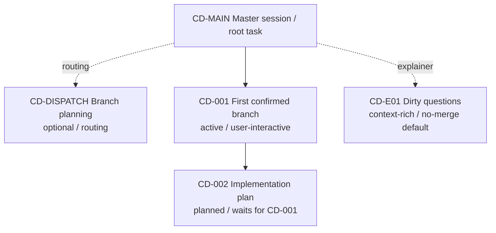

# Conductor Map: Example Project

## Snapshot

- Snapshot id: `snap-2026-06-03-001`
- Updated at: 2026-06-03
- Master session: `[CD-MAIN][master] Project control room`
- Dispatch session: `[CD-DISPATCH][routing] Branch planning`
- Explainer sidecar: `[CD-E01][sidecar][explainer] Dirty questions`
- Active interactive branch limit: 2
- Current global goal: Keep the master session clean while interactive branches do detailed work.
- Current wave: 1

## Today View

### Active Now

- CD-001 First confirmed branch — task — waiting for user review.
- CD-E01 Dirty questions — context-rich explainer sidecar.

### Planned, Not Opened

- CD-002 Implementation plan — waits for CD-001 completion report.

### Dispatch

- CD-DISPATCH is available for routing debate, but no dispatch thread is currently active.

## Wave Plan

| Wave | Branches | Prerequisites | Gate to unlock next wave |
| --- | --- | --- | --- |
| 0 | CD-MAIN | none | scope confirmed |
| 1 | CD-001 | CD-MAIN snapshot | CD-001 completion report ready |
| 2 | CD-002 | CD-001 output | user confirms next implementation step |

## Branch Registry

| Branch | Stable title | Type | Interaction mode | Status | Wave | Depends on | Thread | Task dir | Return condition | Merge policy |
| --- | --- | --- | --- | --- | --- | --- | --- | --- | --- | --- |
| CD-MAIN | `[CD-MAIN][master] Project control room` | master | n/a | active | 0 | none | current | .trellis/tasks/root | project control | approved summaries only |
| CD-DISPATCH | `[CD-DISPATCH][routing] Branch planning` | dispatch | n/a | optional | sidecar | none | none | none | dispatch decision ready | final decisions only |
| CD-001 | `[CD-001][W1][task] First confirmed branch` | branch | user_interactive | active | 1 | CD-MAIN | thr_example_first_branch | .trellis/tasks/first-branch | branch output reviewed | explicit user confirm |
| CD-002 | `[CD-002][W2][implement] Implementation plan` | branch | user_interactive | planned | 2 | CD-001 | none | .trellis/tasks/implementation-plan | implementation plan drafted | explicit user confirm |
| CD-E01 | `[CD-E01][sidecar][explainer] Dirty questions` | explainer | n/a | active | sidecar | none | thr_example_explainer | none | question answered | no merge by default |

## Visualization

## Active Branches

- CD-001: Complete the first user-confirmed branch task and produce a completion report after user-confirmed completion.
- CD-E01: Ask confusing project questions. It may read relevant context across sessions, but default no merge.

## Planned Branches

- CD-002: Waits for CD-001 completion report.

## Blocked / Waiting On Prerequisites

- None.

## Merge Pending

- None.

## Proposed Global Decisions

- None.

## Staleness Warnings

- None.

## Next Recommended Step

- Continue CD-001. Do not start CD-002 until CD-001 produces a completion report.
