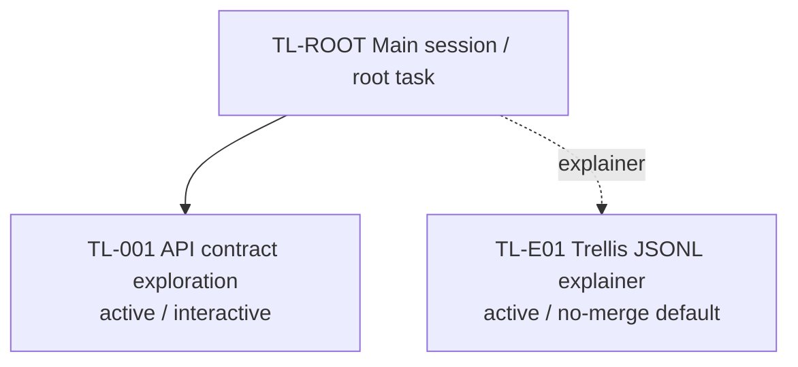

# Trunkline Map: Example Project

## Snapshot

- Snapshot id: `snap-2026-06-03-001`
- Updated at: 2026-06-03
- Master session: `TL-ROOT`
- Active branch limit: 3
- Current global goal: Keep the master session clean while interactive branches do detailed work.

## Branch Registry

| Branch | Type | Status | Thread | Task dir | Based on snapshot | Merge policy |
| --- | --- | --- | --- | --- | --- | --- |
| TL-ROOT | master | active | current | .trellis/tasks/root | snap-2026-06-03-001 | approved summaries only |
| TL-001 | interactive | active | thr_example_api_contract | .trellis/tasks/api-contract | snap-2026-06-03-001 | explicit user confirm |
| TL-E01 | explainer | active | thr_example_explainer | none | snap-2026-06-03-001 | no merge by default |

## Visualization

## Active Branches

- TL-001: Explore the API contract and produce a completion report after user-confirmed completion.
- TL-E01: Explain Trellis JSONL context. Default no merge.

## Merge Pending

- None.

## Proposed Global Decisions

- None.

## Staleness Warnings

- None.

## Next Recommended Step

- Continue TL-001 or create one additional planned branch.
