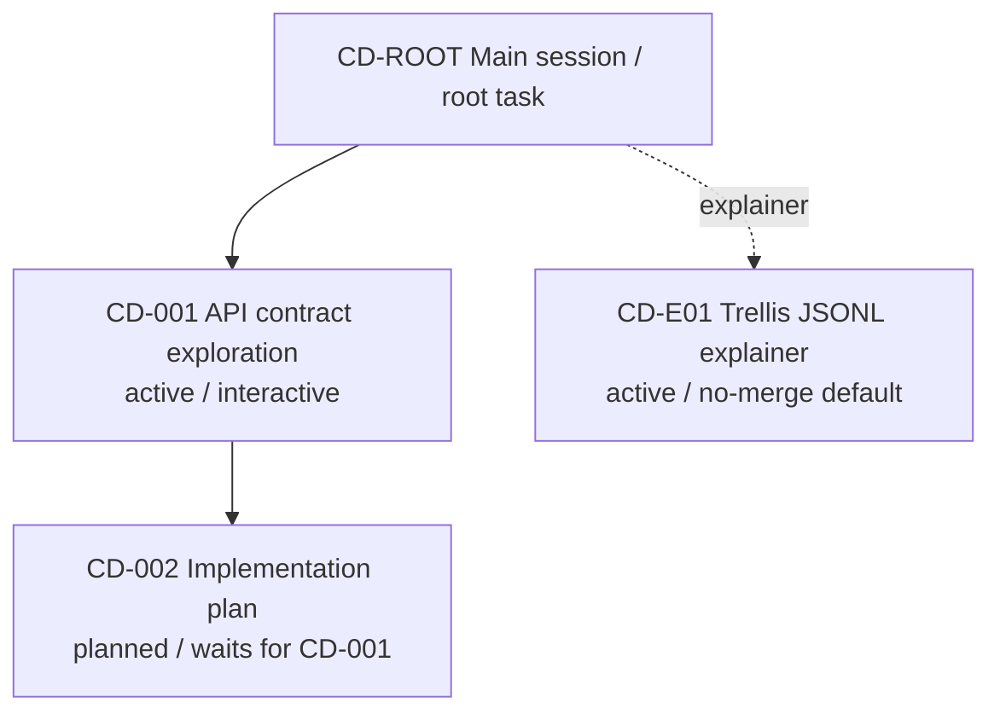

# Conductor Map: Example Project

## Snapshot

- Snapshot id: `snap-2026-06-03-001`
- Updated at: 2026-06-03
- Master session: `CD-ROOT`
- Active branch limit: 3
- Current global goal: Keep the master session clean while interactive branches do detailed work.
- Current wave: 1

## Wave Plan

| Wave | Branches | Prerequisites | Gate to unlock next wave |
| --- | --- | --- | --- |
| 0 | CD-ROOT | none | scope confirmed |
| 1 | CD-001 | CD-ROOT snapshot | CD-001 completion report ready |
| 2 | CD-002 | CD-001 output | user confirms next implementation step |

## Branch Registry

| Branch | Type | Status | Wave | Depends on | Thread | Task dir | Based on snapshot | Merge policy |
| --- | --- | --- | --- | --- | --- | --- | --- | --- |
| CD-ROOT | master | active | 0 | none | current | .trellis/tasks/root | snap-2026-06-03-001 | approved summaries only |
| CD-001 | interactive | active | 1 | CD-ROOT | thr_example_api_contract | .trellis/tasks/api-contract | snap-2026-06-03-001 | explicit user confirm |
| CD-002 | interactive | planned | 2 | CD-001 | none | .trellis/tasks/implementation-plan | snap-2026-06-03-001 | explicit user confirm |
| CD-E01 | explainer | active | sidecar | none | thr_example_explainer | none | snap-2026-06-03-001 | no merge by default |

## Visualization

## Active Branches

- CD-001: Explore the API contract and produce a completion report after user-confirmed completion.
- CD-E01: Explain Trellis JSONL context. Default no merge.

## Planned Branches

- CD-002: Waits for CD-001 completion report.

## Blocked / Waiting On Prerequisites

- None.

## Merge Pending

- None.

## Proposed Global Decisions

- None.

## Staleness Warnings

- None.

## Next Recommended Step

- Continue CD-001. Do not start CD-002 until CD-001 produces a completion report.
