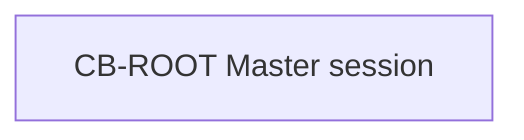

# Clean Branch Map: <project>

## Snapshot

- Snapshot id:
- Updated at:
- Master session:
- Active branch limit: 3
- Current global goal:

## Branch Registry

| Branch | Type | Status | Thread | Task dir | Based on snapshot | Merge policy |
| --- | --- | --- | --- | --- | --- | --- |
| CB-ROOT | master | active |  |  |  | approved summaries only |

## Visualization

## Active Branches

- ...

## Planned Branches

- ...

## Merge Pending

- ...

## Proposed Global Decisions

- ...

## Staleness Warnings

- ...

## Next Recommended Step

- ...
