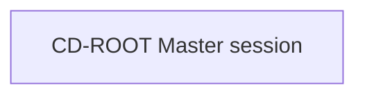

# Conductor Map: <project>

## Snapshot

- Snapshot id:
- Updated at:
- Master session:
- Active branch limit: 3
- Current global goal:
- Current wave:

## Wave Plan

| Wave | Branches | Prerequisites | Gate to unlock next wave |
| --- | --- | --- | --- |
| 0 | CD-ROOT | none | scope confirmed |

## Branch Registry

| Branch | Type | Status | Wave | Depends on | Thread | Task dir | Based on snapshot | Merge policy |
| --- | --- | --- | --- | --- | --- | --- | --- | --- |
| CD-ROOT | master | active | 0 | none |  |  |  | approved summaries only |

## Visualization

## Active Branches

- ...

## Planned Branches

- ...

## Blocked / Waiting On Prerequisites

- ...

## Merge Pending

- ...

## Proposed Global Decisions

- ...

## Staleness Warnings

- ...

## Next Recommended Step

- ...
